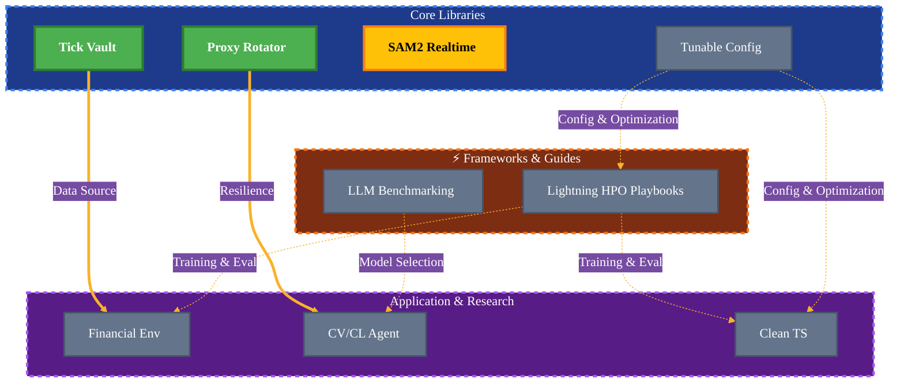

<div align="center">

# Hi, I'm Keyhan 👋

### Converting caffeine & curiosity into tomorrow's math
#### “one gradient at a time”

<a href="https://www.linkedin.com/in/keyhan-kamyar/" target="_blank">
    
</a>
<a href="mailto:keyhankamyar@gmail.com" target="_blank">
    
</a>

</div>

---

### 🔍 Who I Am
```python
# pip install curiosity==∞
from datetime import datetime

from pydantic import BaseModel


class Keyhan(BaseModel, frozen=True):
    """
    ML Engineer who treats research like spelunking—
    you don't know what you'll find until you're deep enough
    that turning back costs more than pushing forward.
    """

    power_on: datetime = datetime(1995, 1, 7)
    coords: tuple[float, float] = (32.6539, 51.6660)
    role: str = "ML Engineer & Researcher"
    fuel: str = "single-origin espresso, 18 g, 25 s, 93 °C"

    principle: str = "Theory is the map; implementation is the territory."
    operating_mode: str = "10-12 hours/day, no weekends. It's not work; it's the game."

    focus: list[str] = [
        "Deep Reinforcement Learning (DRL) for complex control",
        "High-Performance Computing (HPC) & Custom Kernel Optimization",
        "Financial AI & Quantitative Systems",
        "Autonomous Agents & LLM Orchestration",
        "Scalable MLOps, Data Pipelines & Production Deployment",
        "Neural Architecture Search (NAS) & HPO",
    ]

    stack: dict[str, list[str]] = {
        "Languages": ["Python", "C++"],
        "ML Frameworks": ["PyTorch", "TensorFlow"],
        "RL Toolkits": ["Gymnasium", "RLlib", "Stable-Baselines3", "Tianshou", "CleanRL"],
        "HPO & NAS": ["Optuna", "Custom NAS Frameworks", "Ray Tune"],
        "Data Orchestration": ["Pandas", "NumPy", "Numba", "Parquet", "HDF5", "Apache Spark"],
        "Databases": ["MongoDB", "InfluxDB", "SQL"],
        "Deployment & MLOps": ["FastAPI", "Docker", "Git", "CI/CD", "Pydantic"],
        "Web Automation": ["BeautifulSoup", "Playwright"],
        "OS": ["Linux"],
    }

    def philosophy(self) -> str:
        return """
        The gap between a brilliant paper and a production-ready system is a chasm 
        of broken dependencies, hidden bottlenecks, and flawed assumptions. My work 
        lives in that chasm. I write the code that bridges it—transforming theoretical 
        edge into tangible, performant, and maintainable software.
        """
```

---

## 🧰 My Stack

<div align="center">

| Category        | Tools |
|-----------------|-------|
| **Languages**   |   |
| **ML Frameworks** |    |
| **RL Toolkits** |     |
| **LLM & AI**    |       |
| **Data & Compute** |       |
| **Databases**   |    |
| **MLOps & Optimization** |     |
| **Deployment** |     |
| **Web & Automation** |    |

</div>

---

## 🕸️ Projects Web & Roadmap

<div align="center" style="border: 2px solid #333; border-radius: 10px; padding: 20px; background: linear-gradient(135deg, #667eea 0%, #764ba2 100%);">

<p style="color: #fff; font-size: 14px; margin-bottom: 15px;">
This chart shows how my projects build upon and connect with each other, forming a cohesive research and development ecosystem.
</p>



<table style="margin-top: 20px; border-radius: 8px; padding: 10px;">
<tr>
<td align="center" style="background: #f8f9fa; padding: 12px; border-radius: 8px;">
<strong>Legend:</strong> 
🟢 Shipped • 
🟡 Polishing • 
⚫ Planned
</td>
</tr>
</table>

</div>

<br>

<div align="center">

### 📋 Project Details

<table>
<thead>
<tr>
<th width="5%" align="center">#</th>
<th width="20%" align="left">Project</th>
<th width="60%" align="left">Description</th>
<th width="15%" align="center">Status</th>
</tr>
</thead>
<tbody>

<tr>
<td align="center">1</td>
<td><strong>Proxy Rotator</strong></td>
<td>A production-ready library that seamlessly integrates proxy rotation into <code>httpx</code> clients (sync/async). Built for resilience and simplicity in web scraping and API automation workflows.</td>
<td align="center">🚀<br><sub>Shipped</sub></td>
</tr>

<tr>
<td align="center">2</td>
<td><strong>Tick Vault</strong></td>
<td>High-fidelity financial tick data scraper for Dukascopy Bank (Swiss). Extracts raw, sub-second precision market data for quantitative analysis and backtesting.</td>
<td align="center">🚀<br><sub>Shipped</sub></td>
</tr>

<tr>
<td align="center">3</td>
<td><strong>SAM2 Realtime</strong></td>
<td>Text-prompted, real-time video segmentation pipeline optimized for live camera feeds, video streams, and recordings. Achieves >40 FPS through custom kernel optimizations.</td>
<td align="center">🔨<br><sub>Finishing Touches</sub></td>
</tr>

<tr>
<td align="center">4</td>
<td><strong>Tunable Config</strong></td>
<td>Where Optuna meets Pydantic. A research-grade library that unifies hyperparameter optimization, neural architecture search, and feature selection with type-safe, declarative configs. Distilled from years of research into clean, reusable patterns.</td>
<td align="center">⏳<br><sub>Up Next</sub></td>
</tr>

<tr>
<td align="center">5</td>
<td><strong>Lightning HPO Playbooks</strong></td>
<td>Industry-standard examples and guides for model training, optimization, and research using PyTorch Lightning. Covers SOTA practices for NAS, HPO, distributed training, and production-ready ML pipelines.</td>
<td align="center">📝<br><sub>Planned</sub></td>
</tr>

<tr>
<td align="center">6</td>
<td><strong>CV+CL Agent</strong></td>
<td>An agentic framework that auto-generates tailored CVs and cover letters optimized for specific job postings. Combines LLM orchestration with structured outputs for efficient application workflows.</td>
<td align="center">📝<br><sub>Planned</sub></td>
</tr>

<tr>
<td align="center">7</td>
<td><strong>Financial Env</strong></td>
<td>A blazingly fast, parallelized Gymnasium environment for algorithmic trading. Includes a placeholder reward function—the real one stays private (years of research aren't free). Built for large-scale RL training; production readiness TBD pending capital for full-scale experiments.</td>
<td align="center">📝<br><sub>Planned</sub></td>
</tr>

<tr>
<td align="center">8</td>
<td><strong>LLM Benchmarking</strong></td>
<td>A practical guide for building use-case-specific LLM evaluation pipelines. Generic benchmarks mislead; this teaches how to design reliable, domain-aware benchmarks that actually reflect real-world performance.</td>
<td align="center">📝<br><sub>Planned</sub></td>
</tr>

<tr>
<td align="center">9</td>
<td><strong>Clean-TS</strong></td>
<td>A modular, Pythonic reimplementation of canonical time-series architectures. Traditional TS codebases are archaic and opaque—this makes them readable, extensible, and reproducible. Requires ~1 month of polish before release.</td>
<td align="center">📝<br><sub>Planned</sub></td>
</tr>

</tbody>
</table>

</div>

---

<div align="center">

<br>


<br>

<table border="0" align="center">
<tr>
<td align="center" width="50%">

</td>
<td align="center" width="50%">

</td>
</tr>
</table>

<br>


<br><br>

<a href="https://www.linkedin.com/in/keyhan-kamyar/">

</a>
&nbsp;&nbsp;
<a href="mailto:keyhankamyar@gmail.com">

</a>

<br>

<sub>© 2025 Keyhan Kamyar · Fueled by espresso and curiosity · Built with 💜 and late nights</sub>

<br><br>

</div>
